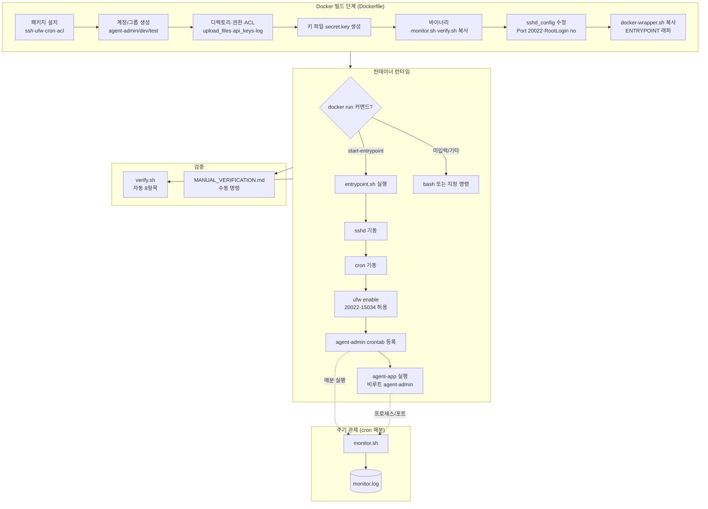
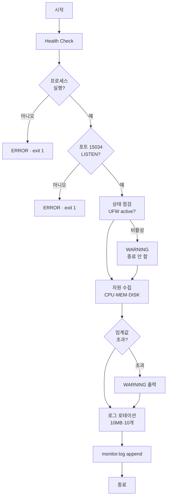
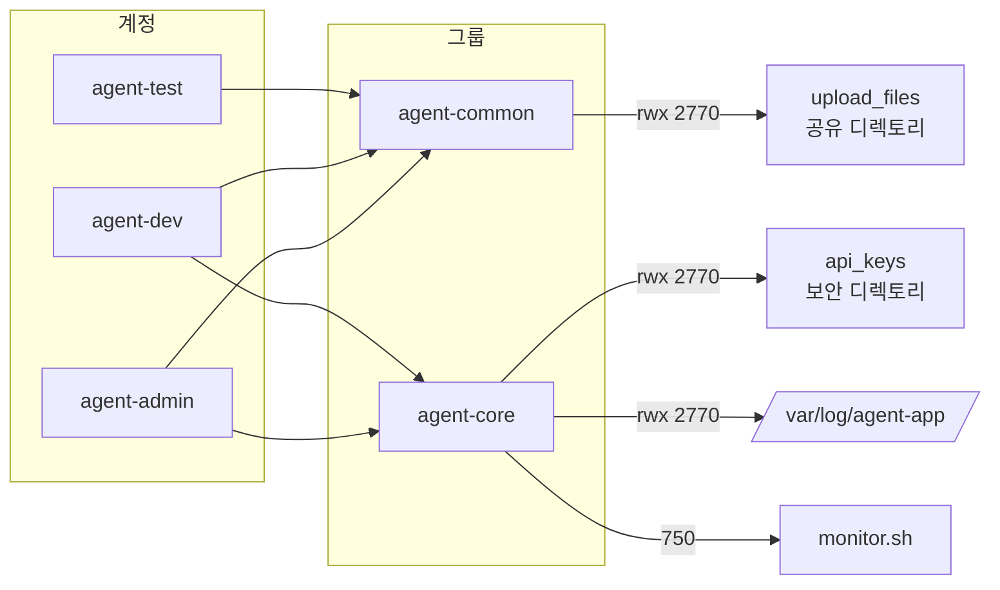

# 구조도

## 1. 전체 구성 (빌드 → 런타임 → 검증)

```mermaid
flowchart TD
    subgraph BUILD["Docker 빌드 단계 (Dockerfile)"]
        P[패키지 설치<br/>ssh·ufw·cron·acl] --> U[계정/그룹 생성<br/>agent-admin/dev/test]
        U --> D[디렉토리·권한·ACL<br/>upload_files·api_keys·log]
        D --> K[키 파일 secret.key 생성]
        K --> C[바이너리·monitor.sh·verify.sh 복사]
        C --> S[sshd_config 수정<br/>Port 20022·RootLogin no]
        S --> W[docker-wrapper.sh 복사<br/>ENTRYPOINT 래퍼]
    end

    subgraph RUN["컨테이너 런타임"]
        W2{docker run 커맨드?} -->|start-entrypoint| E0[entrypoint.sh 실행]
        W2 -->|미입력/기타| BA[bash 또는 지정 명령]
        E0 --> E1[sshd 기동]
        E1 --> E2[cron 기동]
        E2 --> E3[ufw enable<br/>20022·15034 허용]
        E3 --> E4[agent-admin crontab 등록]
        E4 --> E5[agent-app 실행<br/>비루트 agent-admin]
    end

    subgraph MON["주기 관제 (cron 매분)"]
        M[monitor.sh] --> LOG[(monitor.log)]
    end

    subgraph VERIFY["검증"]
        V1[verify.sh<br/>자동 8항목]
        V2[MANUAL_VERIFICATION.md<br/>수동 명령]
    end

    BUILD --> RUN
    E4 -.매분 실행.-> M
    E5 -.프로세스/포트.-> M
    RUN --> V1
    RUN --> V2
```

## 2. monitor.sh 내부 흐름

```mermaid
flowchart TD
    A[시작] --> B[Health Check]
    B --> B1{프로세스<br/>실행?}
    B1 -- 아니오 --> X1[ERROR · exit 1]
    B1 -- 예 --> B2{포트 15034<br/>LISTEN?}
    B2 -- 아니오 --> X2[ERROR · exit 1]
    B2 -- 예 --> C[상태 점검<br/>UFW active?]
    C -- 비활성 --> C1[WARNING<br/>종료 안 함]
    C --> D[자원 수집<br/>CPU·MEM·DISK]
    C1 --> D
    D --> E{임계값<br/>초과?}
    E -- 초과 --> E1[WARNING 출력]
    E --> F[로그 로테이션<br/>10MB·10개]
    E1 --> F
    F --> G[monitor.log append]
    G --> H[종료]
```

## 3. 권한 모델 (역할 기반 + 최소 권한)

```mermaid
flowchart LR
    subgraph USERS["계정"]
        AD[agent-admin]
        DV[agent-dev]
        TS[agent-test]
    end
    subgraph GROUPS["그룹"]
        GC[agent-common]
        GK[agent-core]
    end
    AD --> GC
    AD --> GK
    DV --> GC
    DV --> GK
    TS --> GC

    GC -->|rwx 2770| UP[upload_files<br/>공유 디렉토리]
    GK -->|rwx 2770| AK[api_keys<br/>보안 디렉토리]
    GK -->|rwx 2770| LG[/var/log/agent-app/]
    GK -->|750| MS[monitor.sh]
```
